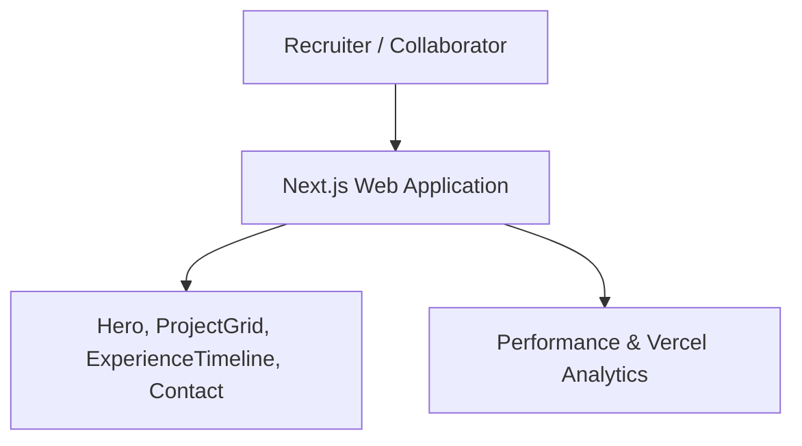
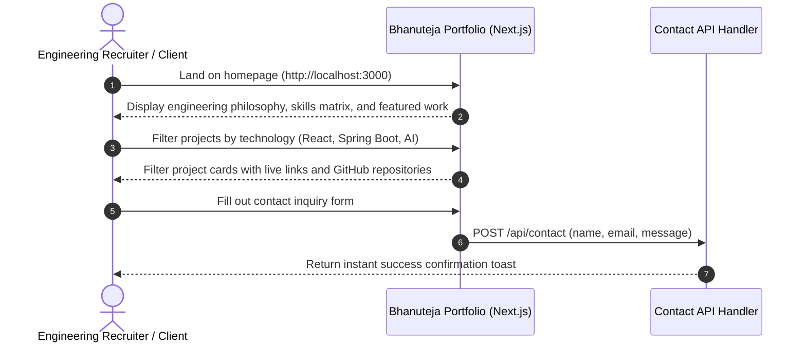

# Bhanuteja Nallamothu — Full-Stack Developer Portfolio
[]()
[]()
[]()
[]()

## Overview
A high-performance modern developer portfolio website built for Bhanuteja Nallamothu using Next.js 15, TypeScript, Tailwind CSS, and Radix UI. It showcases engineering proficiencies, full-stack architectures, published applications, open-source repositories, and professional experience.

- **Problem Solved:** Professional personal branding, project discovery, and developer presentation.
- **Target Users:** Recruiters, engineering leaders, collaborators, and clients.
- **Current Status:** Production Ready Web Portfolio.

## Features
- **Featured Projects Showcase:** Interactive cards detailing technologies, live demos, and source links.
- **Skills Matrix:** Visual categorization of languages, frontend/backend frameworks, and cloud tooling.
- **Interactive Contact Form:** Direct inquiry submission for opportunities and collaborations.
- **Dark / Light Mode:** Adaptive color palette with seamless theme transitions.

## Architecture


## User Flow


## Technology Stack
| Layer | Technology | Purpose |
|---|---|---|
| Framework | Next.js 15 (App Router) | High-speed static generation & SSR |
| Language | TypeScript | Static typing and maintainability |
| Styling | Tailwind CSS | Modern responsive design system |
| Icons | Lucide React | High-clarity iconography |

## Infrastructure
- **Server Port:** 3000
- **Hosting Target:** Vercel Edge Network

## Project Structure
```text
Nallamothu_Bhanuteja/
├── src/
│   ├── app/             # Next.js App Router (page.tsx, layout.tsx)
│   ├── components/      # ProjectCard, SkillBadge, ContactForm, Navbar
│   └── lib/             # Project and career data constants
├── package.json         # Dependencies
├── next.config.ts       # Next.js build configuration
├── .gitignore           # Git ignore definitions
└── README.md            # Technical documentation
```

## Prerequisites
- Node.js >= 18.x
- npm >= 9.x

## Environment Variables
Create `.env.local` using placeholders:
```env
NEXT_PUBLIC_SITE_URL=https://bhanuteja.dev
CONTACT_FORM_ENDPOINT=https://formspree.io/f/your_form_id_optional
```

## Local Development Setup
1. Clone the repository:
   ```bash
   git clone https://github.com/Bhanutejanallamothu/Nallamothu_Bhanuteja.git
   cd Nallamothu_Bhanuteja
   ```
2. Install dependencies:
   ```bash
   npm install
   ```
3. Run development server:
   ```bash
   npm run dev
   ```
4. Open `http://localhost:3000`.

## Docker Setup
*Not detected in repository. Deployable directly to Vercel.*

## Database Setup
*Not applicable. Content is statically driven via structured data modules.*

## API Documentation
- `POST /api/contact` - Sends contact inquiry message.

## Deployment
```bash
npm run build
```
Deploy to Vercel with zero configuration.

## Security
- Contact form rate limiting to prevent spam abuse.
- Safe external link rendering (`rel="noopener noreferrer"`).

## Testing
```bash
npm run lint
```

## Troubleshooting
- **Build Errors:** Ensure TypeScript definitions are satisfied.

## Future Improvements
- Interactive 3D interactive avatar using Three.js / React Three Fiber.
- Automated GitHub repository activity feed.

## License
All rights reserved by Bhanuteja Nallamothu.
